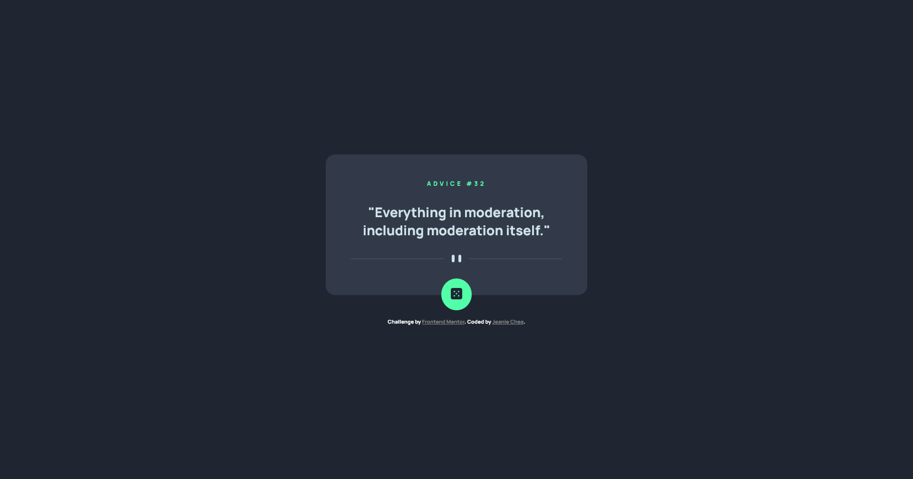
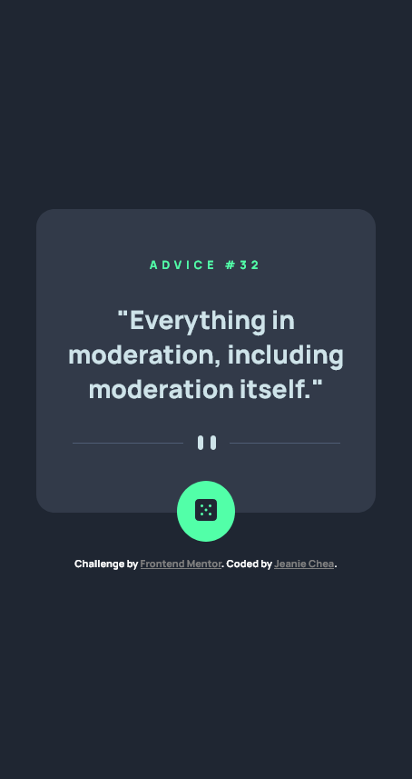

# Frontend Mentor - Advice generator app solution

This is a solution to the [Advice generator app challenge on Frontend Mentor](https://www.frontendmentor.io/challenges/advice-generator-app-QdUG-13db). Frontend Mentor challenges help you improve your coding skills by building realistic projects.

## Table of contents

- [Overview](#overview)
  - [The challenge](#the-challenge)
  - [Screenshot](#screenshot)
  - [Links](#links)
- [My process](#my-process)
  - [Built with](#built-with)
  - [What I learned](#what-i-learned)
  - [Continued development](#continued-development)
- [Author](#author)
- [Acknowledgments](#acknowledgments)

## Overview

### The challenge

Users should be able to:

- View the optimal layout for the app depending on their device's screen size
- See hover states for all interactive elements on the page
- Generate a new piece of advice by clicking the dice icon

### Screenshot

Desktop


Mobile


### Links

- Solution URL: [Add solution URL here](https://your-solution-url.com)
- Live Site URL: [Add live site URL here](https://your-live-site-url.com)

## My process

### Built with

- Flexbox
- Mobile-first workflow
- [Axios](https://axios-http.com/) - Promise based HTTP client
- [Advice Slip API](https://api.adviceslip.com) - Advice API

### What I learned

- Practiced DOM manipulation in JavaScript with clearing the previous text and overriding it with new text.
- Practiced consuming APIs using axios to understand more about promises and grab specific API data from an endpoint.
- Destructuring returned API results like this:
```js
const advice = async () => {
    const res = await axios.get('https://api.adviceslip.com/advice')
    return [`"${res.data.slip.advice}"`, res.data.slip.id]
}

const addAdvice = async () => {
    ...
    const [adviceText, adviceNum] = await advice()
    ...
}
```

### Continued development

In the future I plan to redo the advice generator app using React.

## Author

- Website - [Jeanie Chea](https://www.your-site.com)
- Frontend Mentor - [@yourusername](https://www.frontendmentor.io/profile/yourusername)

## Acknowledgments

- [tsbsankara](https://www.youtube.com/c/tsbsankara)
    - tsbsankara's video solution helped me understand more about CSS and he explained the reasons why and how some ways he did was good to use.
